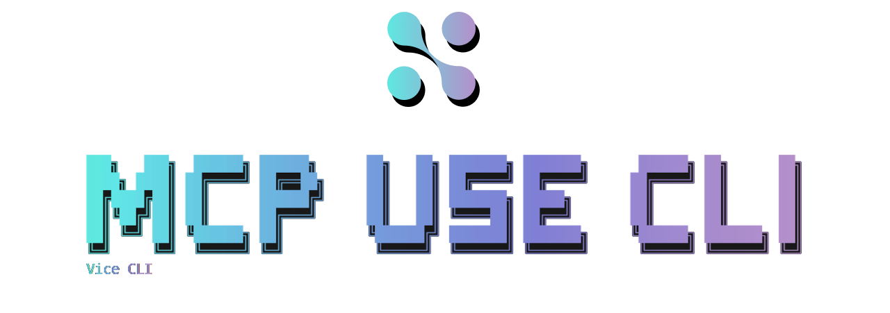

<div align="center">
  
</div>

# Open Source and Open Model CLI for MCP

A CLI tool for interacting with Model Context Protocol (MCP) servers using natural language.

## Built with [mcp-use](https://mcp-use.com), build your own MCP application with our SDKs:

<h4><strong>Python</strong> <a href="https://github.com/mcp-use/mcp-use">mcp-use/mcp-use</a></h4>
<h4><strong>Typescript</strong> <a href="https://github.com/mcp-use/mcp-use-ts">mcp-use/mcp-use-ts</a></h4>

## Features

- 🤖 Natural language interface for MCP servers
- 💬 Interactive chat interface with tool call visualization
- ⚡ Direct integration with mcp-use (no API layer needed)
- 🚀 Single command installation
- 🔄 **Over a dozen LLM providers** (OpenAI, Anthropic, Google, Mistral, Groq, Cohere, and more)
- ⚙️ **Slash commands** for configuration (like Claude Code)
- 🔑 **Smart API key prompting** - automatically asks for keys when needed
- 💾 **Persistent secure storage** - encrypted keys and settings saved across sessions

## Install

```bash
$ npm install --global @mcp-use/cli
```

## Quick Start

1. **Install and run**:

   ```bash
   $ npm install --global @mcp-use/cli
   $ mcp-use
   ```

2. **Choose your model** (CLI handles API key setup automatically):

   ```bash
   # Just pick a model - that's it!
   /model openai gpt-4o
   /model anthropic claude-3-5-sonnet-20240620
   /model google gemini-1.5-pro
   /model groq llama-3.1-70b-versatile
   /model ollama llama3

   # CLI will prompt: "Please enter your OPENAI API key:"
   # Paste your key and start chatting immediately!
   ```

3. **Get API keys** when prompted from providers like:
   - [OpenAI](https://platform.openai.com/api-keys)
   - [Anthropic](https://console.anthropic.com/)
   - [Google AI](https://aistudio.google.com/app/apikey)
   - [Mistral](https://console.mistral.ai/)
   - [Groq](https://console.groq.com/keys)
   - [Cohere](https://dashboard.cohere.com/api-keys)

> **Keys are stored securely encrypted** in `~/.mcp-use-cli/config.json` and persist across sessions.

## Alternative Setup

If you prefer environment variables:

```bash
export OPENAI_API_KEY=your_key_here
export ANTHROPIC_API_KEY=your_key_here
# Then just run: mcp-use
```

## Usage

```
$ mcp-use --help

  Usage
    $ mcp-use

  Options
    --name        Your name (optional)
    --config      Path to MCP configuration file (optional)

  Examples
    $ mcp-use
    $ mcp-use --name=Jane

  Environment Variables
    <PROVIDER>_API_KEY    Set API keys (e.g., OPENAI_API_KEY, ANTHROPIC_API_KEY)

  Setup
    1. Run: mcp-use
    2. Use /model or /setkey to configure an LLM.
    3. Use /server commands to connect to your tools.
    4. Start chatting!
```

## Connecting to Tools (MCP Servers)

This CLI is a client for [Model Context Protocol (MCP)](https://github.com/mcp-use/mcp-spec) servers. MCP servers act as tools that the AI can use. You need to connect the CLI to one or more servers to give it capabilities.

You can manage servers with the `/server` commands:

```bash
# Interactively add a new server configuration
/server add

# List configured servers
/servers

# Connect to a configured server
/server connect <server-name>

# Disconnect from a server
/server disconnect <server-name>
```

When you add a server, you'll be prompted for its configuration details, such as the command to run it. Here is an example of what a server configuration for a filesystem tool looks like:

```json
{
	"filesystem-tool": {
		"command": "npx",
		"args": [
			"-y",
			"@modelcontextprotocol/server-filesystem",
			"/path/to/your/project"
		],
		"env": {}
	}
}
```

This configuration would be created interactively by running `/server add` and answering the prompts.

## Slash Commands

Switch LLM providers and configure settings using slash commands:

```bash
# Set API keys (stored securely)
/setkey openai sk-1234567890abcdef...
/setkey anthropic ant_1234567890abcdef...
/clearkeys  # Clear all stored keys

# Switch models
/model openai gpt-4o
/model anthropic claude-3-5-sonnet-20240620
/model google gemini-1.5-pro
/model mistral mistral-large-latest
/model groq llama-3.1-70b-versatile

# List available models
/models

# Server Management
/server add
/servers
/server connect <name>
/server disconnect <name>

# Configuration
/config temp 0.5
/config tokens 4000

# Status and help
/status
/help
```

## Chat Examples

- "List files in the current directory"
- "Create a new file called hello.txt with the content 'Hello, World!'"
- "Search for files containing 'TODO'"
- "What's the structure of this project?"

## Architecture

This CLI uses:

- **Frontend**: React + Ink for the terminal UI
- **Agent**: mcp-use MCPAgent for LLM + MCP integration
- **LLM**: Your choice of 12+ providers
- **Transport**: Direct TypeScript integration (no API layer)

## Privacy & Telemetry

This package uses [Scarf](https://scarf.sh) to collect basic installation analytics to help us understand how the package is being used. This data helps us improve the tool and prioritize features.

### What data is collected?

Scarf collects:

- Operating system information
- IP address (used only for company lookup, not stored)
- Limited dependency tree information (hashed for privacy)

**No personally identifying information is stored.**

### How to disable telemetry

You can opt out of analytics in several ways:

**Option 1: Environment variable**

```bash
export SCARF_ANALYTICS=false
```

**Option 2: Standard Do Not Track**

```bash
export DO_NOT_TRACK=1
```

**Option 3: For package maintainers**
If you distribute a package that depends on this CLI, you can disable analytics for all your downstream users by adding this to your `package.json`:

```json
{
	"scarfSettings": {
		"enabled": false
	}
}
```

For more information about Scarf and privacy, visit [scarf.sh](https://scarf.sh).

## License

MIT
