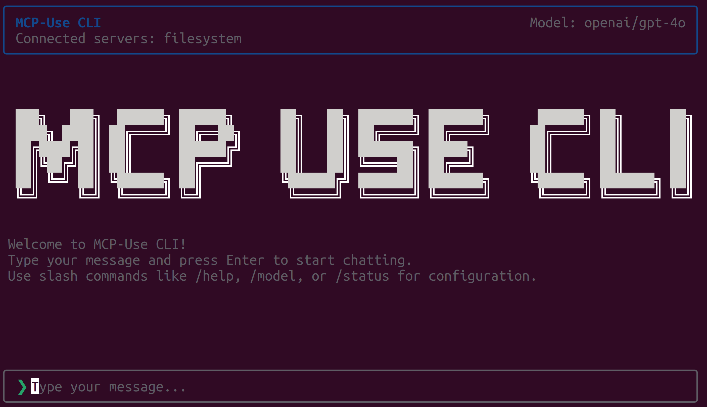

<div align="center">
  
</div>

A CLI tool for interacting with Model Context Protocol (MCP) servers using natural language. Built with [mcp-use](https://github.com/mcp-use/mcp-use-ts) and powered by OpenAI's GPT models.

## Features

- 🤖 Natural language interface for MCP servers
- 🔧 Built-in filesystem MCP server support
- 💬 Interactive chat interface with tool call visualization
- ⚡ Direct integration with mcp-use (no API layer needed)
- 🚀 Single command installation
- 🔄 **Multiple LLM providers** (OpenAI, Anthropic, Google, Mistral)
- ⚙️ **Slash commands** for configuration (like Claude Code)
- 🔑 **Smart API key prompting** - automatically asks for keys when needed
- 💾 **Persistent secure storage** - encrypted keys and settings saved across sessions

## Install

```bash
$ npm install --global mcp-use-cli
```

## Quick Start

1. **Install and run**:
   ```bash
   $ npm install --global mcp-use-cli
   $ mcp-use-cli
   ```

2. **Choose your model** (CLI handles API key setup automatically):
   ```bash
   # Just pick a model - that's it!
   /model openai gpt-4o-mini
   /model anthropic claude-3-5-sonnet-20241022
   /model google gemini-1.5-pro
   
   # CLI will prompt: "Please enter your OPENAI API key:"
   # Paste your key and start chatting immediately!
   ```

3. **Get API keys** when prompted from:
   - [OpenAI](https://platform.openai.com/api-keys)
   - [Anthropic](https://console.anthropic.com/) 
   - [Google AI](https://aistudio.google.com/app/apikey)
   - [Mistral](https://console.mistral.ai/)

> **Keys are stored securely encrypted** in `~/.mcp-use-cli/config.json` and persist across sessions.

## Alternative Setup

If you prefer environment variables:
```bash
export OPENAI_API_KEY=your_key_here
export ANTHROPIC_API_KEY=your_key_here
# Then just run: mcp-use-cli
```

## Usage

```
$ mcp-use-cli --help

  Usage
    $ mcp-use-cli

  Options
    --name        Your name (optional)
    --config      Path to MCP configuration file (optional)

  Examples
    $ mcp-use-cli
    $ mcp-use-cli --name=Jane
    $ mcp-use-cli --config=./mcp-config.json

  Environment Variables
    OPENAI_API_KEY    Required - Your OpenAI API key

  Setup
    1. Set your OpenAI API key: export OPENAI_API_KEY=your_key_here
    2. Run: mcp-use-cli
    3. Start chatting with MCP servers!
```

## Configuration

By default, the CLI connects to a filesystem MCP server in `/tmp`. You can provide a custom configuration file:

```json
{
  "servers": {
    "filesystem": {
      "command": "npx",
      "args": ["-y", "@modelcontextprotocol/server-filesystem", "/path/to/directory"],
      "env": {}
    },
    "other-server": {
      "command": "your-mcp-server-command",
      "args": ["--arg1", "value1"],
      "env": {}
    }
  }
}
```

## Slash Commands

Switch LLM providers and configure settings using slash commands (similar to Claude Code):

```bash
# Set API keys (stored securely)
/setkey openai sk-1234567890abcdef...
/setkey anthropic ant_1234567890abcdef...
/clearkeys  # Clear all stored keys

# Switch models
/model openai gpt-4o
/model anthropic claude-3-5-sonnet-20241022
/model google gemini-1.5-pro
/model mistral mistral-large-latest

# List available models
/models
/models anthropic

# Configuration
/config temp 0.5
/config tokens 4000

# Status and help
/status
/help
```

## Chat Examples

- "List files in the current directory"
- "Create a new file called hello.txt with the content 'Hello, World!'"
- "Search for files containing 'TODO'"
- "What's the structure of this project?"

## Architecture

This CLI uses:
- **Frontend**: React + Ink for the terminal UI
- **Agent**: mcp-use MCPAgent for LLM + MCP integration
- **LLM**: OpenAI GPT-4o-mini
- **Transport**: Direct TypeScript integration (no API layer)

## License

MIT
